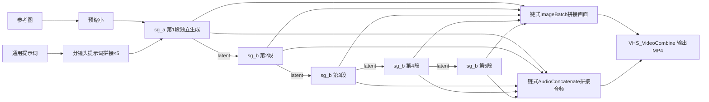

# 🎬 ComfyUI MiniMax-H3 R2V Long Video Workflow


基于 ComfyUI 的 MiniMax-H3 参考生视频（Reference-to-Video）长视频工作流。通过多段分镜头拼接突破单段时长限制，集成 Larry Turbo 加速，在 RTX 5060 8GB 入门级显卡上可稳定生成 15 秒+ 带音频的长视频。

---

## ⚡ 速度对比

以下数据为相同测试条件下的参考值，实际速度因机器配置、分辨率、分镜头数量、提示词复杂度而异。

| 方案 | 15秒视频耗时 | 采样步数 | 说明 |
|------|-------------|----------|------|
| 社区导演台（默认配置） | ~50-60 分钟 | 25 步 | 无加速，官方默认配置 |
| 本工作流 v1.4.0（上一稳定版） | ~22 分钟 | 5 步 | H3 Motion Context，音频衰减明显 |
| **本工作流 v1.4.1（当前主推）** | **~36.6 分钟** | **8 步** | **音频质量显著提升，衰减轻微，连贯性大幅改善** |

> 💡 **两种模式**：
> - **高质量模式（默认，8步）**：音频质量好，连贯性强，耗时约36分钟
> - **快速测试模式（5步）**：速度快约40%，但音频衰减明显，适合快速验证画面
>
> Larry Turbo LoRA 作者指出步数太少会"thicken the sound"（音频变浑浊），8 步是音质与速度的均衡点。

### 🖥️ 测试环境

| 项目 | 配置 |
|------|------|
| CPU | Intel Core i5-14490F（10核） |
| 主板 | 技嘉 B760M POWER DDR4 |
| 内存 | 16GB DDR4 2400MHz（阿斯加特 8GB×2） |
| GPU | NVIDIA GeForce RTX 5060 8GB |
| 存储 | 致钛 Ti600 1TB NVMe SSD（ComfyUI 安装盘） |
| 系统 | Windows 11 专业版 64位 |
| ComfyUI | v0.34.0（秋叶整合包） |
| PyTorch | 2.8.0+cu129 |
| Python | 3.12.10 |
| 测试参数 | 0.3MP 分辨率，5 段分镜头，每段 3 秒，共 15 秒 |

> 💡 8GB 显存是入门级配置，本工作流在该显存下可稳定运行 0.3MP 分辨率；更高配置的机器速度更快，可跑更高分辨率。

### 🖥️ 硬件要求（基于 MiniMax-H3 官方与社区实测）

本工作流不额外增加显存需求，硬件要求与 MiniMax-H3 原生一致。

| 显存 | 代表显卡 | 支持能力 |
|------|----------|----------|
| 6GB | RTX 2060 | 可运行，速度较慢，需开启动态卸载 |
| **8GB** | RTX 3060 8G / 4060 / 5060 | 可运行（int8量化+动态卸载），0.3MP 分辨率推荐 |
| **12GB** | RTX 3060 12G / 4070 | **ComfyUI 官方确认的实用门槛**，流畅运行短视频 |
| 16GB+ | 4060Ti / 4070Ti / 5070 | 流畅运行，可尝试更高分辨率 |
| 24GB+ | 4090 / 5090 | 效率最高，支持大分辨率长视频 |

**系统要求**：
- NVIDIA 显卡（A 卡适配较差，不推荐）
- 系统内存 ≥ 32GB（推荐 64GB）
- NVMe 固态，剩余空间 ≥ 100GB
- ComfyUI ≥ v0.30.0，CUDA 驱动 ≥ 12.1
- 模型文件路径全英文无空格

> 数据来源：MiniMax 官方文档、ComfyUI 官方团队测试、社区实测汇总。30 系及以上 NVIDIA 显卡均支持。

---

## ✨ 功能特点

- **🎞️ 多段分镜头**：5 段独立分镜头，每段可单独设置提示词和时长（1-10秒）
- **🔗 H3 Motion Context**：latent 直接传递，无色偏无软化，音画连贯性显著提升
- **📝 通用提示词**：人物/场景统一编写，自动拼接到每段分镜头提示词前
- **🚀 Larry Turbo 加速**：8 步采样（默认），相比官方 25 步配置提速约 2 倍
- **📐 全局分辨率控制**：统一调整所有分镜头的输出分辨率
- **🎥 画布内视频预览**：VHS_VideoCombine 节点支持生成后直接在画布上预览视频
- **📂 7区域布局**：设置/提示词/拼接/子图/音频/视频/文档，清晰分区，节点零重叠
- **🎵 纯乐器配乐提示词**：通用提示词内置音频控制模板，引导生成无人声纯乐器背景音乐

---

## 🎬 示例产出

以下为工作流实际生成效果，参考图与产出视频均来自本地测试。

### 输入参考图

使用 Z-Image Turbo 官方文生图模板生成（8步 / cfg1.5 / 720×1280），仅作为视频工作流的输入演示。

<p align="center">
  
</p>

> 参考图详细生成参数与提示词见 [docs/examples.md](docs/examples.md)

### 输出视频（5段×3秒 = 15秒，0.3MP，9:16竖屏，v1.4.1 8步采样）

<p align="center">
  <a href="https://ironmanvincent.github.io/comfyui-minimax-h3-r2v-longvideo/assets/examples/demo_output.mp4" target="_blank">
    
  </a>
  <br>
  <i>👆 点击图片播放演示视频（15秒，纯乐器配乐，5段分镜头，8步采样）</i>
</p>

**测试参数**：
- 工作流版本：v1.4.1
- 分辨率：0.3MP（9:16竖屏）
- 分镜头：5段，每段3秒
- 总时长：15秒
- 采样步数：8步（simple调度器）
- 耗时：约36.6分钟（RTX 5060 8GB）
- 音频：纯乐器配乐（无人声）

**分镜头设计**：
1. 上半身中景，人物动态姿势，镜头微推
2. 脸部特写，细腻表情，眨眼微笑
3. 腿部特写，自然交叉动作，环绕镜头
4. 腰臀曲线特写，侧身姿态
5. 肩颈胸部特写，拉远收尾

---

## 📋 版本更新

### v1.4.1（当前稳定版，2026-09-01）

核心改进：
- **采样步数 5→8 步**：音频质量显著提升，消除音质衰减、卡顿、重复现象
- **音频连贯性大幅改善**：各分镜音频风格统一，衔接自然
- **CreateVideo 替换为 VHS_VideoCombine**：执行更稳定，支持API和前端运行
- **Markdown Note 更新**：含性能对照表和参数指南

测试效能（RTX 5060 8GB）：
- 5段×3秒=15秒视频，0.3MP分辨率，8步采样，总耗时约 36.6 分钟

### v1.4.0（上一稳定版，2026-08-30）

核心改进：
- 引入 H3 Motion Context 社区方案，latent 上下文传递实现音画无缝衔接
- 子图化架构：第1段独立生成，第2-5段链式 latent 传递
- 7区域清晰布局，节点零重叠
- 各分镜头默认时长 3 秒，快速测试友好
- 新增依赖：ComfyUI-H3-Motion-Context

> 更早版本的详细变更记录请参阅 [CHANGELOG.md](CHANGELOG.md)

---

## 🔧 依赖安装

### 1. ComfyUI 版本要求

需要 **ComfyUI v0.34.0 及以上**（含原生 H3 AV-mask 支持和官方 MiniMax-H3 节点）。

推荐使用秋叶整合包，或从官方仓库更新到最新版。

### 2. 自定义节点（必装 4 个插件）

| 插件 | 用途 | 安装地址 |
|------|------|----------|
| ComfyUI-MiniMax-H3-Turbo | Larry Turbo 加速节点（Turbo LoRA + Turbo Sampler） | `https://github.com/larryvrh/ComfyUI-MiniMax-H3-Turbo.git` |
| ComfyUI-Custom-Scripts | StringFunction 字符串拼接节点（pythongosssss） | `https://github.com/pythongosssss/ComfyUI-Custom-Scripts.git` |
| ComfyUI-VideoHelperSuite | 视频拼接节点（VHS：ImageBatch、AudioConcatenate、VHS_VideoCombine） | `https://github.com/Kosinkadink/ComfyUI-VideoHelperSuite.git` |
| **ComfyUI-H3-Motion-Context** | **H3 Motion Context 上下文传递** | `https://github.com/NikoDemon80/ComfyUI-H3-Motion-Context.git` |

<details>
<summary><b>安装方法（点击展开）</b></summary>

**方法一：ComfyUI Manager（推荐）**
1. 打开 ComfyUI Manager
2. 选择 Install Custom Nodes
3. 搜索插件名，点击安装
4. 重启 ComfyUI

**方法二：手动安装**
```bash
cd ComfyUI/custom_nodes
git clone https://github.com/larryvrh/ComfyUI-MiniMax-H3-Turbo.git
git clone https://github.com/pythongosssss/ComfyUI-Custom-Scripts.git
git clone https://github.com/Kosinkadink/ComfyUI-VideoHelperSuite.git
git clone https://github.com/NikoDemon80/ComfyUI-H3-Motion-Context.git
```
重启 ComfyUI。

</details>

### 3. 模型文件（共 5 个）

将以下模型放入对应目录：

| 用途 | 文件名 | 存放目录 |
|------|--------|----------|
| UNET（r2v 参考生视频专用） | `minimax_h3_ref2va_pruned_int8_convrot.safetensors` | `ComfyUI/models/diffusion_models/` |
| Larry Turbo LoRA | `minimax_h3_turbo_v4_step600_ema.safetensors` | `ComfyUI/models/loras/` |
| CLIP 文本编码器 | `qwen3vl_32b_minimax_h3_nvfp4_awq.safetensors` | `ComfyUI/models/text_encoders/` |
| 视频 VAE | `minimax_h3_video_vae_fp16.safetensors` | `ComfyUI/models/vae/` |
| 音频 VAE | `minimax_h3_audio_vae_fp32.safetensors` | `ComfyUI/models/vae/` |

**模型下载地址**：
- 官方模型（UNET/CLIP/Video VAE/Audio VAE）：[Comfy-Org/MiniMax-H3 (Hugging Face)](https://huggingface.co/Comfy-Org/MiniMax-H3)
- Larry Turbo LoRA：[MiniMax-H3-Turbo-Lora (Hugging Face)](https://huggingface.co/larryvrh/MiniMax-H3-Turbo-Lora)

> ⚠️ **注意**：r2v 模式必须使用 `ref2va` 版本的 UNET，不能用 `fl2va` 版本。Turbo LoRA 推荐 v4-600 版本，支持 4-8 步采样。

---

## 🚀 快速开始

### 第一步：确认环境

1. 确认 ComfyUI 版本 ≥ v0.34.0
2. 确认已安装上述 4 个自定义节点插件
3. 确认 5 个模型文件已放入对应目录
4. 启动 ComfyUI，无报错

### 第二步：加载工作流

1. 打开 ComfyUI 网页界面
2. 将 `workflows/minimax_h3_r2v_longvideo_v1.4.1.json` 拖入画布
3. 工作流自动加载，所有节点显示正常（无红色缺失节点）

### 第三步：加载参考图

1. 找到 **LoadImage** 节点（画布左侧区域1）
2. 点击上传按钮，选择一张人物参考图
3. 参考图建议：清晰的单人或多人正面/半身照

### 第四步：编写提示词

1. **通用提示词**节点（区域2蓝色大文本框）：已预填模板，按需修改人物描述、场景、音频约束
2. **分镜头1-5提示词**节点：分别编写每段的景别、动作、剧情
   - 每段提示词会自动与通用提示词拼接

### 第五步：调整参数

1. **每段时长**：5 个时长节点，默认 3 秒，可独立调整（1-10秒）
2. **全局分辨率**：ResolutionSelector 节点，默认 0.3MP（8GB显存推荐）
3. **采样步数**：BasicScheduler 节点，默认 8 步（高质量），快速测试可降为 5 步
4. **随机种子**：每个分镜头有独立 seed，默认 randomize

### 第六步：生成

1. 点击 **Queue Prompt**
2. 等待生成（5段×3秒约36分钟，RTX 5060 8GB，8步采样）
3. 生成完成后，视频在 VHS_VideoCombine 节点可直接预览

---

## 🏗️ 工作流结构



每个分镜头生成子图包含：
- MiniMaxH3ReferenceToVideo（官方参考生视频 conditioning）
- H3MotionContext（上下文传递，第2-5段）
- MiniMaxH3TurboSampler（Larry 加速采样器）
- VAE 解码（画面+音频分离解码）

---

## ⚙️ 关键参数说明

| 参数 | 默认值 | 说明 |
|------|--------|------|
| 全局分辨率 | 0.3MP (736×416) | 8GB显存推荐；12GB+可尝试0.4MP |
| 采样步数 | **8** | 默认8步（高质量）；快速测试可降为5步；Larry Turbo推荐范围4-8步 |
| 采样器 | euler | 新版ComfyUI中等同于Turbo Sampler |
| 调度器 | simple | Larry推荐，不建议修改 |
| LoRA strength | 1.0 | Larry调优值，不建议修改 |
| 每段时长 | 3秒 | 1-10秒可调，帧数自动适配17k+5网格 |
| CFG | 1.0 | MiniMax-H3官方推荐固定值 |
| context_length | 22帧 | 上下文帧数，约0.92秒，作者推荐 |
| audio_context_length | 24帧 | 音频上下文，1秒，精确对齐40Hz网格 |
| Trim match_tail | true | 自动对齐音频尾部，避免累积误差 |

---

## 📏 帧数规则

MiniMax-H3 的视频帧数必须符合 `17×k+5` 网格，工作流自动计算，无需手动调整：

| 时长（秒） | 帧数 | 计算公式 |
|-----------|------|----------|
| 1 | 22 | 17×1+5 |
| 2 | 39 | 17×2+5 |
| 3 | 73 | 17×4+5 |
| 5 | 124 | 17×7+5 |
| 7 | 175 | 17×10+5 |
| 10 | 243 | 17×14+5 |

---

## ❓ 常见问题 FAQ

<details>
<summary><b>Q: 爆显存（CUDA OOM）怎么办？</b></summary>

按以下顺序尝试：
1. 降低全局分辨率到 0.2MP
2. 减少每段时长（如从5秒降到3秒）
3. 开启 Turbo LoRA 节点的 `low_vram` 模式
4. 关闭其他占用显存的程序

</details>

<details>
<summary><b>Q: 人物不一致/变脸怎么办？</b></summary>

1. 确保通用提示词中明确声明人物参考
2. 参考图选择清晰的正面照，避免遮挡
3. 分镜头提示词避免描述与参考图矛盾的外貌特征
4. 降低采样步数到4步（减少重绘幅度）

</details>

<details>
<summary><b>Q: 音频有人声旁白/说话声怎么办？</b></summary>

在通用提示词中明确声明："纯环境音效，无人声旁白，无对话，无唱歌，无语音"。工作流默认已包含此约束。

</details>

<details>
<summary><b>Q: 8步采样太慢，能降回5步吗？</b></summary>

可以。将 BasicScheduler 节点的步数从 8 改为 5 即可。5步速度快约40%，但音频衰减明显，适合快速验证画面效果。正式产出建议用8步。

</details>

<details>
<summary><b>Q: 如何增加/减少分镜头数量？</b></summary>

当前版本需要手动操作：
1. 复制一整组分镜头节点（提示词+时长+生成子图）
2. 将新分镜头的画面输出连接到 ImageBatch
3. 将新分镜头的音频输出连接到 AudioConcatenate
4. 调整通用提示词的字符串拼接节点数量

</details>

---

## ⚠️ 已知限制

1. **分镜头数量固定**：当前为 5 段，增减需要手动复制/删除一组节点
2. **显存限制**：8GB显存建议 0.3MP 分辨率、单段 5 秒以内
3. **提示词语言**：推荐中文提示词，CLIP编码器（Qwen3-VL）对中文支持良好
4. **8步采样耗时**：比5步慢约60%，但音频质量显著提升

---

## 🗺️ 开发路线图

### 已完成
- [x] 固定5段分镜头长视频生成
- [x] Larry Turbo 加速，性能比社区导演台快2-3倍
- [x] H3 Motion Context 上下文传递，音画连贯性提升
- [x] 通用提示词+分镜头提示词分离架构
- [x] 全局分辨率控制 + 各分镜头独立时长控制
- [x] 纯乐器配乐提示词模板
- [x] 7区域清晰布局
- [x] **音频质量优化（v1.4.1）**：8步采样解决音频衰减问题

### 进行中 / 规划中
- [ ] **动态增删分镜头**（核心需求）：用户可自由添加/删除分镜头组，无需手动复制节点
- [ ] 分镜头过渡效果优化：CrossFade / RIFE插帧等平滑过渡
- [ ] 更多分镜头模板：电影感、写真、剧情等预设提示词包

> 动态增删分镜头是社区用户反馈最多的需求，也是下一阶段的核心开发方向。

---

## 📚 相关文档

- [示例产出详细说明](docs/examples.md) — 输入参考图参数、输出视频配置、完整提示词
- [版本更新日志](CHANGELOG.md) — 各版本详细更新记录
- [开发流程与规范](docs/DEVELOPMENT.md) — 开发工作流、发版检查清单、经验教训

---

## 🙏 致谢

- [Larryvrh/ComfyUI-MiniMax-H3-Turbo](https://github.com/larryvrh/ComfyUI-MiniMax-H3-Turbo) — Turbo 加速节点和 LoRA 权重
- [NikoDemon80/ComfyUI-H3-Motion-Context](https://github.com/NikoDemon80/ComfyUI-H3-Motion-Context) — H3 Motion Context 上下文传递节点
- [Comfy-Org/MiniMax-H3](https://huggingface.co/Comfy-Org/MiniMax-H3) — 官方模型权重
- [pythongosssss/ComfyUI-Custom-Scripts](https://github.com/pythongosssss/ComfyUI-Custom-Scripts) — StringFunction 节点
- [Kosinkadink/ComfyUI-VideoHelperSuite](https://github.com/Kosinkadink/ComfyUI-VideoHelperSuite) — VHS 视频拼接节点

---

## ☕ 支持作者

这个工作流完全免费开源，没有任何付费功能。如果它帮你节省了时间，或者你觉得好用，欢迎请作者喝杯咖啡 ☕

<p align="center">
  
</p>

<p align="center">
  <i>微信扫码赞赏，金额随意，感谢支持！</i>
</p>

---

## 📄 License

MIT License — 详见 [LICENSE](LICENSE) 文件。
