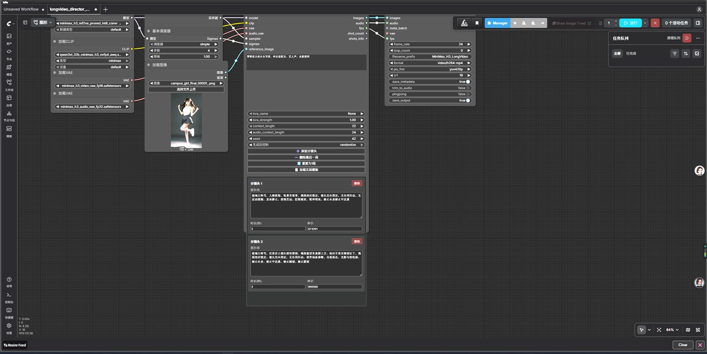
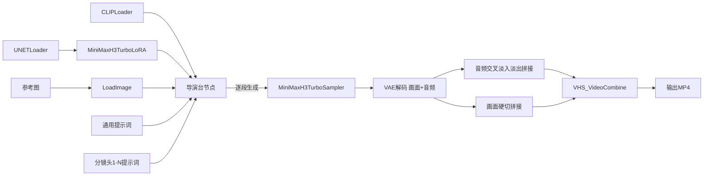

# 🎬 ComfyUI MiniMax-H3 长视频导演台


基于 ComfyUI 自定义节点的 MiniMax-H3 参考生视频（Reference-to-Video）**长视频导演台**。通过自定义节点实现**真正的动态分镜头增删**，突破静态工作流的分镜头数量限制，集成 Larry Turbo 加速，在 RTX 5060 8GB 入门级显卡上可稳定生成带音频的长视频。

> 🆕 **v2.0.0 大版本更新**：从静态工作流升级为自定义节点包，支持动态增删分镜头，git clone 即装即用。

---

## ⚡ 速度对比

以下数据为相同测试条件下的参考值，实际速度因机器配置、分辨率、分镜头数量、提示词复杂度而异。

| 方案 | 6秒视频耗时 | 采样步数 | 说明 |
|------|-------------|----------|------|
| 社区导演台（默认配置） | ~50-60 分钟 | 25 步 | 无加速，官方默认配置 |
| 本项目 v1.4.2（静态工作流） | ~20-24 分钟（15秒） | 4 步 | 固定5段分镜头，性能优化版 |
| **本项目 v2.0.0（导演台）** | **~13 分钟** | **5 步** | **动态分镜头增删，bypass模式，性能提升35%** |

> 💡 **采样步数选择**：
> - **4步（快速测试）**：速度最快，约10分钟，适合快速验证提示词
> - **5步（默认，推荐）**：质量与性能平衡，约13分钟
> - **8步（最佳质量）**：音频质量最佳，约30分钟，适合正式产出
>
> Larry Turbo LoRA v4 支持 4-8 步采样，步数越多音频质量越好，但耗时增加。

### 🖥️ 测试环境

| 项目 | 配置 |
|------|------|
| CPU | Intel Core i5-14490F（10核） |
| 主板 | 技嘉 B760M POWER DDR4 |
| 内存 | 16GB DDR4 2400MHz |
| GPU | NVIDIA GeForce RTX 5060 8GB |
| 存储 | 致钛 Ti600 1TB NVMe SSD |
| 系统 | Windows 11 专业版 64位 |
| ComfyUI | v0.34.3（秋叶整合包） |
| PyTorch | 2.8.0+cu129 |
| Python | 3.12.10 |
| 测试参数 | 0.3MP 分辨率，2 段分镜头，每段 3 秒，共 6 秒 |

### 🖥️ 硬件要求

| 显存 | 代表显卡 | 支持能力 |
|------|----------|----------|
| 6GB | RTX 2060 | 可运行，速度较慢，需开启动态卸载 |
| **8GB** | RTX 3060 8G / 4060 / 5060 | 可运行（int8量化），0.3MP 分辨率推荐 |
| **12GB** | RTX 3060 12G / 4070 | 流畅运行，可尝试更高分辨率 |
| 16GB+ | 4060Ti / 4070Ti / 5070 | 流畅运行，支持多段分镜头 |
| 24GB+ | 4090 / 5090 | 效率最高，支持大分辨率长视频 |

---

## ✨ 功能特点

- **🎛️ 真正动态分镜头增删**：自定义节点实现，点击按钮即可添加/删除分镜头，最少1段，无上限
- **📝 分镜头独立编辑**：每个分镜头有独立的提示词编辑窗口、时长设置、随机种子
- **📋 五段模板一键加载**：内置人像写真模板（头→肩颈胸→腰臀→腿→上半身ending）
- **🎵 通用提示词**：人物/场景/音频风格统一编写，自动应用到所有分镜头
- **🚀 Larry Turbo 加速**：v4-600 LoRA + Turbo Sampler，5步采样，相比官方25步提速约2-3倍
- **🔗 音频无缝衔接**：trim首尾静音 + 100ms等功率交叉淡入淡出，衔接自然无突变
- **🎞️ 画面硬切**：分镜头之间硬切（Cut），符合电影分镜头语言，无重影模糊
- **🎵 纯乐器配乐控制**：提示词中明确指定纯乐器配乐，避免人声歌唱
- **📐 全局分辨率控制**：统一调整所有分镜头的输出分辨率
- **🎥 画布内视频预览**：VHS_VideoCombine 节点支持生成后直接在画布上预览
- **📦 即装即用**：git clone 到 custom_nodes 目录即可使用，无需手动配置

---

## 🎬 示例产出

以下为导演台实际生成效果，参考图与产出视频均来自本地测试。

### 输入参考图

使用 Z-Image Turbo 官方文生图模板生成，仅作为视频工作流的输入演示。

<p align="center">
  
</p>

> 📋 参考图详细生成参数、模型配置、完整提示词与负向提示词见 [docs/examples.md](docs/examples.md)

### 输出视频（2段×3秒 = 6秒，0.3MP，9:16竖屏，v2.0.0 5步采样，bypass模式）

<p align="center">
  <a href="https://ironmanvincent.github.io/comfyui-minimax-h3-r2v-longvideo/assets/examples/demo_output.mp4" target="_blank">
    
  </a>
  <br>
  <i>👆 点击图片在线播放演示视频（6秒，纯乐器配乐，2段分镜头，5步采样）</i>
</p>

**测试参数**：

| 参数 | 值 |
|------|-----|
| 工作流版本 | v2.0.0 导演台 |
| 分辨率 | 0.3MP（9:16竖屏） |
| 分镜头 | 2段，每段3秒 |
| 总时长 | 6秒 |
| 采样步数 | 5步（simple调度器） |
| Larry LoRA | v4 step600，bypass模式 |
| 耗时 | ~13分钟（RTX 5060 8GB） |
| 音频 | 纯乐器配乐（无人声） |

> 📋 输出视频完整工作流配置、六段式通用提示词、五段分镜头完整提示词、测试环境详细配置见 [docs/examples.md](docs/examples.md)

---

## 📦 安装方法

### 方法一：git clone（推荐，即装即用）

```bash
cd ComfyUI/custom_nodes
git clone https://github.com/IronManVincent/comfyui-minimax-h3-r2v-longvideo.git ComfyUI-MiniMaxH3-LongVideo
```

重启 ComfyUI，节点自动加载。

### 方法二：ComfyUI Manager

1. 打开 ComfyUI Manager
2. 搜索 `MiniMaxH3 LongVideo`
3. 点击安装
4. 重启 ComfyUI

### 方法三：手动下载

1. 下载本仓库 ZIP
2. 解压到 `ComfyUI/custom_nodes/ComfyUI-MiniMaxH3-LongVideo/`
3. 重启 ComfyUI

---

## 🔧 依赖安装

### 1. ComfyUI 版本要求

需要 **ComfyUI v0.34.0 及以上**（含原生 H3 AV-mask 支持和官方 MiniMax-H3 节点）。

推荐使用秋叶整合包，或从官方仓库更新到最新版。

### 2. 自定义节点（必装 3 个插件）

| 插件 | 用途 | 安装地址 |
|------|------|----------|
| ComfyUI-MiniMax-H3-Turbo | Larry Turbo 加速节点（Turbo LoRA + Turbo Sampler） | `https://github.com/larryvrh/ComfyUI-MiniMax-H3-Turbo.git` |
| ComfyUI-VideoHelperSuite | 视频拼接节点（VHS：VHS_VideoCombine） | `https://github.com/Kosinkadink/ComfyUI-VideoHelperSuite.git` |
| ComfyUI-Custom-Scripts | 字符串拼接等工具节点 | `https://github.com/pythongosssss/ComfyUI-Custom-Scripts.git` |

<details>
<summary><b>手动安装方法（点击展开）</b></summary>

```bash
cd ComfyUI/custom_nodes
git clone https://github.com/larryvrh/ComfyUI-MiniMax-H3-Turbo.git
git clone https://github.com/Kosinkadink/ComfyUI-VideoHelperSuite.git
git clone https://github.com/pythongosssss/ComfyUI-Custom-Scripts.git
```

重启 ComfyUI。

</details>

### 3. 模型文件（共 5 个）

| 用途 | 文件名 | 存放目录 |
|------|--------|----------|
| UNET（r2v 参考生视频专用） | `minimax_h3_ref2va_pruned_int8_convrot.safetensors` | `ComfyUI/models/diffusion_models/` |
| Larry Turbo LoRA | `minimax_h3_turbo_v4_step600_ema.safetensors` | `ComfyUI/models/loras/` |
| CLIP 文本编码器 | `qwen3vl_32b_minimax_h3_nvfp4_awq.safetensors` | `ComfyUI/models/text_encoders/` |
| 视频 VAE | `minimax_h3_video_vae_fp16.safetensors` | `ComfyUI/models/vae/` |
| 音频 VAE | `minimax_h3_audio_vae_fp32.safetensors` | `ComfyUI/models/vae/` |

**模型下载地址**：
- 官方模型（UNET/CLIP/Video VAE/Audio VAE）：[Comfy-Org/MiniMax-H3 (Hugging Face)](https://huggingface.co/Comfy-Org/MiniMax-H3)
- Larry Turbo LoRA：[MiniMax-H3-Turbo-Lora (Hugging Face)](https://huggingface.co/larryvrh/MiniMax-H3-Turbo-Lora)

> ⚠️ **注意**：r2v 模式必须使用 `ref2va` 版本的 UNET。Turbo LoRA 必须使用 v4-600 版本，支持 4-8 步采样。

---

## 🚀 快速开始

### 第一步：确认环境

1. 确认 ComfyUI 版本 ≥ v0.34.0
2. 确认已安装上述 3 个自定义节点插件
3. 确认 5 个模型文件已放入对应目录
4. 确认本节点包已安装到 custom_nodes
5. 启动 ComfyUI，无报错

### 第二步：加载工作流

1. 打开 ComfyUI 网页界面
2. 将 `workflows/minimax_h3_r2v_longvideo_v2.0.0.json` 拖入画布
3. 工作流自动加载，所有节点显示正常（无红色缺失节点）

### 第三步：加载参考图

1. 找到 **LoadImage** 节点
2. 点击上传按钮，选择一张人物参考图
3. 参考图建议：清晰的单人正面/半身照，720p分辨率最佳

### 第四步：使用导演台节点

找到 **MiniMaxH3LongVideoDirector** 节点：

1. **默认1个分镜头**：打开工作流默认只有1个分镜头
2. **添加分镜头**：点击 `➕ 添加分镜头` 按钮，增加新的分镜头编辑卡片
3. **删除分镜头**：点击分镜头卡片上的 `🗑️ 删除` 按钮，删除该分镜头（最少保留1个）
4. **加载五段模板**：点击 `📋 加载五段模板`，一键加载人像写真模板
5. **编辑提示词**：在每个分镜头卡片中编辑提示词、时长、随机种子

### 第五步：编写提示词

1. **通用提示词**：导演台节点顶部的大文本框，定义人物/场景/音频风格，自动应用到所有分镜头
2. **分镜头提示词**：每个分镜头卡片中的文本框，定义该段的景别、动作、运镜

### 第六步：调整参数

1. **采样步数**：BasicScheduler 节点，默认 5 步（推荐）
2. **全局分辨率**：默认 0.3MP（8GB显存推荐）
3. **Larry LoRA**：MiniMaxH3TurboLoRA 节点，low_vram=False（bypass模式，最锐利）

### 第七步：生成

1. 点击 **Queue Prompt**
2. 等待生成（2段×3秒约13分钟，RTX 5060 8GB，5步采样）
3. 生成完成后，视频在 VHS_VideoCombine 节点可直接预览

---

## 🎛️ 导演台节点使用说明

### 节点界面

<p align="center">
  
</p>

导演台节点包含以下区域：

| 区域 | 说明 |
|------|------|
| 通用提示词 | 顶部大文本框，定义整体风格，应用到所有分镜头 |
| 分镜头卡片列表 | 每个分镜头一个卡片，包含提示词、时长、种子 |
| ➕ 添加分镜头按钮 | 点击添加新的分镜头卡片 |
| 📋 加载五段模板按钮 | 一键加载人像写真五段模板 |
| shots_data（隐藏） | 内部数据，用户无需关注 |

### 分镜头卡片

每个分镜头卡片包含：

| 参数 | 说明 | 默认值 |
|------|------|--------|
| 提示词 | 该段分镜头的画面描述、动作、运镜 | 模板提示词 |
| 时长 | 该段视频时长（秒） | 3 |
| 随机种子 | 该段的随机种子 | randomize |
| 🗑️ 删除按钮 | 删除该分镜头（最少保留1个） | - |

### 五段模板说明

点击 `📋 加载五段模板` 后，自动加载5个分镜头，采用人像写真调度：

| 分镜头 | 景别 | 内容 |
|--------|------|------|
| 第1段 | 极端大特写 | 头部脸部，表情灵动，眨眼微笑 |
| 第2段 | 特写 | 肩颈胸部曲线，姿态生动 |
| 第3段 | 特写 | 腰臀部曲线，侧身动态 |
| 第4段 | 特写 | 腿部姿态，自然动作 |
| 第5段 | 近景 | 上半身 ending pose，活力收尾 |

> 💡 每段都是局部特写，避免中远景人脸崩坏。超过5段后，新增分镜头提示词留空，由用户自行编写。

---

## 🏗️ 工作流架构



### 导演节点内部流程

1. 接收 model、clip、参考图、通用提示词、分镜头数据
2. 逐段生成：每段独立 conditioning，独立采样
3. 音频处理：trim首尾静音 + 100ms等功率交叉淡入淡出
4. 画面处理：硬切拼接（无交叉淡入淡出，避免重影）
5. 输出：拼接后的图像序列 + 音频轨道

---

## ⚙️ 关键参数说明

| 参数 | 默认值 | 说明 |
|------|--------|------|
| 全局分辨率 | 0.3MP | 8GB显存推荐；12GB+可尝试0.4MP |
| 采样步数 | **5** | 默认5步（平衡）；4步快速测试；8步最佳质量 |
| 采样器 | euler | 新版ComfyUI中等同于Turbo Sampler |
| 调度器 | simple | Larry推荐，不建议修改 |
| LoRA strength | 1.0 | Larry调优值，不建议修改 |
| low_vram | False | bypass模式，最锐利，性能更好；8GB显存推荐 |
| 每段时长 | 3秒 | 1-10秒可调 |
| CFG | 1.0 | MiniMax-H3官方推荐固定值 |
| context_length | 5 | 上下文帧数，larry推荐 |
| 音频交叉淡入淡出 | 100ms | 衔接处音频平滑过渡 |

---

## 📏 帧数规则

MiniMax-H3 的视频帧数必须符合 `17×k+5` 网格，导演台节点自动计算，无需手动调整：

| 时长（秒） | 帧数 | 计算公式 |
|-----------|------|----------|
| 1 | 22 | 17×1+5 |
| 2 | 39 | 17×2+5 |
| 3 | 73 | 17×4+5 |
| 5 | 124 | 17×7+5 |
| 7 | 175 | 17×10+5 |
| 10 | 243 | 17×14+5 |

---

## ❓ 常见问题 FAQ

<details>
<summary><b>Q: 爆显存（CUDA OOM）怎么办？</b></summary>

按以下顺序尝试：
1. 降低全局分辨率到 0.2MP
2. 减少每段时长（如从5秒降到3秒）
3. 开启 Turbo LoRA 节点的 `low_vram=True`（merge模式）
4. 减少分镜头数量
5. 关闭其他占用显存的程序

</details>

<details>
<summary><b>Q: 人物不一致/变脸怎么办？</b></summary>

1. 确保通用提示词中明确声明人物参考
2. 参考图选择清晰的正面照，避免遮挡
3. 分镜头提示词避免描述与参考图矛盾的外貌特征
4. 使用局部特写（头/肩/胸/臀/腿），避免中远景

</details>

<details>
<summary><b>Q: 音频有人声旁白/说话声怎么办？</b></summary>

在通用提示词中明确声明："纯乐器配乐，无人声，无唱歌，无对话，无旁白"。导演台模板已包含此约束。如仍出现人声，可尝试增加采样步数到8步。

</details>

<details>
<summary><b>Q: 分镜头衔接处音频有突变怎么办？</b></summary>

导演台节点已内置100ms等功率交叉淡入淡出，正常情况下衔接自然。如仍有问题：
1. 检查各分镜头提示词中的音频风格是否一致
2. 尝试增加采样步数
3. 确保通用提示词中定义了统一的配乐风格

</details>

<details>
<summary><b>Q: 如何添加/删除分镜头？</b></summary>

- **添加**：点击导演台节点上的 `➕ 添加分镜头` 按钮
- **删除**：点击分镜头卡片上的 `🗑️ 删除` 按钮
- **最少1个**：不允许删除到0个分镜头
- **超过5段**：第6段及以后提示词留空，由用户自行编写

</details>

<details>
<summary><b>Q: 导演台节点不显示分镜头编辑界面怎么办？</b></summary>

1. 确认ComfyUI版本 ≥ v0.34.0
2. 重启ComfyUI服务
3. 浏览器按 Ctrl+F5 强制刷新（清除JS缓存）
4. 确认节点包已正确安装到 custom_nodes 目录
5. 查看ComfyUI启动日志，确认无节点导入错误

</details>

---

## ⚠️ 已知限制

1. **分镜头画面硬切**：分镜头之间为硬切（Cut），无交叉淡入淡出，符合电影分镜头语言
2. **显存限制**：8GB显存建议 0.3MP 分辨率、单段 5 秒以内
3. **提示词语言**：推荐中文提示词，CLIP编码器（Qwen3-VL）对中文支持良好
4. **音频质量**：MiniMax-H3模型特性，后段音频可能存在轻微衰减，属模型层面限制

---

## 🗺️ 开发路线图

### 已完成
- [x] 固定5段分镜头长视频生成（v1.x）
- [x] Larry Turbo 加速，性能比社区导演台快2-3倍
- [x] 纯乐器配乐提示词模板
- [x] 音频质量优化（8步采样解决衰减问题）
- [x] 性能与镜头优化（4步采样提速40%）
- [x] **自定义节点包架构（v2.0.0）**：git clone即装即用
- [x] **真正动态分镜头增删（v2.0.0）**：点击按钮添加/删除
- [x] **分镜头独立编辑界面（v2.0.0）**：提示词、时长、种子
- [x] **五段模板一键加载（v2.0.0）**：人像写真调度
- [x] **音频交叉淡入淡出（v2.0.0）**：100ms等功率，衔接自然

### 规划中
- [ ] 分镜头过渡效果选项：硬切/淡入淡出/溶解
- [ ] 更多分镜头模板：电影感、剧情、舞蹈等预设
- [ ] 分镜头拖拽排序
- [ ] 分镜头复制功能
- [ ] 批量导出分镜头提示词

---

## 📋 版本更新

### v2.0.0（当前版本，2026-09-03）

**架构级更新**：从静态工作流升级为自定义节点包

核心改进：
- **自定义节点包**：git clone即装即用，无需手动配置
- **真正动态分镜头增删**：点击按钮添加/删除，最少1段，无上限
- **分镜头独立编辑界面**：每个分镜头有独立的提示词、时长、种子
- **五段模板一键加载**：人像写真调度（头→肩颈胸→腰臀→腿→上半身ending）
- **音频交叉淡入淡出**：100ms等功率，衔接自然无突变
- **画面硬切**：符合电影分镜头语言，无重影模糊
- **bypass模式**：low_vram=False，最锐利画质，性能提升35%
- **5步采样默认**：质量与性能平衡

测试效能（RTX 5060 8GB）：
- 2段×3秒=6秒视频，0.3MP分辨率，5步采样，总耗时约 13 分钟

### v1.4.2（上一稳定版，2026-09-02）

核心改进：
- 采样步数 8→4 步，性能提升约40%
- 镜头语言全面优化，青春活力版提示词
- 极特写构图，避免人脸崩坏

> 更早版本的详细变更记录请参阅 [CHANGELOG.md](CHANGELOG.md)

---

## 🙏 致谢

- [Larryvrh/ComfyUI-MiniMax-H3-Turbo](https://github.com/larryvrh/ComfyUI-MiniMax-H3-Turbo) — Turbo 加速节点和 LoRA 权重
- [Comfy-Org/MiniMax-H3](https://huggingface.co/Comfy-Org/MiniMax-H3) — 官方模型权重
- [pythongosssss/ComfyUI-Custom-Scripts](https://github.com/pythongosssss/ComfyUI-Custom-Scripts) — 工具节点
- [Kosinkadink/ComfyUI-VideoHelperSuite](https://github.com/Kosinkadink/ComfyUI-VideoHelperSuite) — VHS 视频拼接节点

---

## ☕ 支持作者

这个项目完全免费开源，没有任何付费功能。如果它帮你节省了时间，或者你觉得好用，欢迎请作者喝杯咖啡 ☕

<p align="center">
  
</p>

<p align="center">
  <i>微信扫码赞赏，金额随意，感谢支持！</i>
</p>

---

## 📄 License

MIT License — 详见 [LICENSE](LICENSE) 文件。

